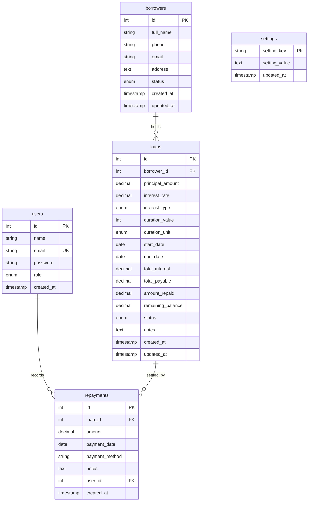

# MoneyLend — Personal Money Lending Management System

> **"Simple Lending. Smarter Tracking."**

MoneyLend is a modern, lightweight, and secure web application engineered for personal money lenders, private credit administrators, and small-scale lending operations. It provides an intuitive, high-trust dashboard to manage borrowers, create and track loan agreements with automated interest calculations, record installment repayments with balance-tracking ledgers, generate printable official receipts, analyze portfolio health through visual charts, and export filtered data to CSV.

Designed with native PHP, MySQL, PDO, and vanilla web standards, MoneyLend delivers strong application security, financial audit integrity, and responsive design across desktop, tablet, and mobile devices without requiring complex external framework runtimes.

---

## 🌟 Key Features

- **Administrative Authentication:** Secure session-based authentication featuring bcrypt password hashing, session fixation defense, and unauthenticated route guarding.
- **Executive Financial Dashboard:** Real-time visibility into Total Borrowers, Active Loans, Total Amount Lent, Total Amount Repaid, and Net Outstanding Balance, accompanied by quick action shortcuts and recent activity feeds.
- **Borrower Relationship Management:** Full CRUD capabilities for borrower profiles, contact management, Indian 10-digit mobile number validation, multi-field search, status filtering, and loan history tracking.
- **Loan Portfolio Management:** Creation and tracking of loan agreements supporting both **Flat** and **Simple Interest** models, flexible duration units (Months/Years), automated maturity due date projection, and live repayment progress bars.
- **Automated Loan Status Lifecycle:** Real-time status evaluation (`Active`, `Partially Paid`, `Paid`, `Overdue`, `Cancelled`) ensuring accurate delinquency tracking without falsely marking settled loans as overdue.
- **Repayment Ledger & Receipts:** Installment logging with payment methods (`Cash`, `UPI`, `Bank Transfer`, `Cheque`), strict server-side overpayment rejection, atomic balance recalculation, and printable official repayment vouchers.
- **Reports & Portfolio Analytics:** Multi-parameter filtering by date presets and custom scopes, Chart.js visual collection trends and loan status distribution donuts, payment method share tables, top borrower rankings, and overdue loan delinquency monitors.
- **Secure CSV Streaming:** One-click CSV exports for filtered loan portfolios and repayment ledgers featuring CSV formula injection mitigation and UTF-8 BOM Excel compatibility.
- **Application Settings & Admin Profile:** Centralized configuration of branding name, currency symbol, date formatting, loan/repayment defaults, profile updates, and secure password change workflows.
- **Security Protections:** Multi-layered defense-in-depth including prepared PDO statements, anti-CSRF token verification, universal HTML entity escaping, secure HTTP headers, and technical error suppression.
- **Responsive & Accessible Design:** Handcrafted responsive CSS system adapting seamlessly from 375px mobile screens to 1440px+ desktop displays, featuring mobile drawer navigation and `@media print` stylesheets.

---

## 💻 Technology Stack

| Layer | Technologies & Tools | Purpose |
| :--- | :--- | :--- |
| **Backend** | PHP 8.2+ (Native, Object-Oriented PDO) | Server-side logic, routing, financial calculations, and security guards |
| **Database** | MySQL 5.7+ / MariaDB 10.3+ (InnoDB Engine) | Relational data persistence, foreign key cascades, and transactional integrity |
| **Database Access** | PHP Data Objects (PDO) | Native prepared statements and parameterized query execution |
| **Frontend UI** | HTML5 Semantic Markup, Vanilla CSS3, Vanilla JS | Lightweight, framework-free client rendering and reactive DOM manipulation |
| **Styling Framework**| Bootstrap 5.3 (via CDN) | Base grid layout, modern typography, and utility styling |
| **Icons & Typography**| Font Awesome 6 Free CDN, Inter Google Font | Clean financial aesthetic, iconography, and high legibility |
| **Data Visualization**| Chart.js 4.4 (via CDN) | Dynamic collection trend and status donut charts |
| **Authentication** | Native PHP Sessions | Secure session cookie handling, strict mode, and session regeneration |
| **Web Server** | Apache 2.4+ (via XAMPP) | Local HTTP request serving, URL routing, and security headers |
| **Version Control** | Git & GitHub | Source code revision control, release tagging, and release preparation |

---

## 🏛️ System Architecture

MoneyLend follows a classic 3-tier client-server architecture with an emphasis on predictable state management and strict server-side financial authority:

```text
Browser (Desktop 1440px / Tablet 768px / Mobile 375px)
   ↓
HTML5 / CSS3 / Vanilla JavaScript (Bootstrap 5 & Chart.js)
   ↓
Apache Web Server (XAMPP)
   ↓
PHP Application Layer (Auth Guard, CSRF, Financial Helpers, PRG Flow)
   ↓
PDO (Native Prepared Statements)
   ↓
MySQL / MariaDB Relational Database (InnoDB ACID Transactions)
```

---

## 📁 Project Directory Structure

```text
moneylend/
│
├── index.php                      # Application entry router (redirects to dashboard or login)
├── login.php                      # Administrative login portal with CSRF and rate safeguards
├── logout.php                     # Secure session termination and cookie destruction
├── dashboard.php                  # Executive financial overview, metrics, and recent activity
│
├── config/
│   ├── config.php                 # Global constants, timezone, currency, and error suppression
│   └── database.php               # Singleton PDO connection provider with socket fallback
│
├── includes/
│   ├── auth.php                   # Session security, auth guards, CSRF tokens, and flash messages
│   ├── header.php                 # Reusable HTML head, meta tags, Google Fonts, and CDNs
│   ├── navbar.php                 # Reusable top navigation, active breadcrumb, and user avatar
│   ├── sidebar.php                # Reusable side navigation with dynamic active route detection
│   ├── footer.php                 # Reusable page footer, copyright notice, and script loader
│   ├── loan_helper.php            # Authoritative interest, status, and balance synchronization engine
│   └── settings_helper.php        # System configuration retrieval and persistence helpers
│
├── assets/
│   ├── css/
│   │   └── style.css              # Custom MoneyLend design system, tokens, and responsive queries
│   ├── js/
│   │   └── script.js              # Vanilla JavaScript for mobile drawer, alerts, and duplicate submit guards
│   └── images/
│       └── .gitkeep               # Directory placeholder for static assets
│
├── activity/
│   └── index.php                  # Centralized activity & audit trail with action/module filters
│
├── borrowers/
│   ├── index.php                  # Borrower directory listing with search and status filters
│   ├── add.php                    # New client registration form with phone/email duplicate validation
│   ├── edit.php                   # Borrower profile modification form
│   ├── view.php                   # Detailed borrower profile, metric summary, and loan portfolio ledger
│   ├── statement.php              # Printable official client financial statement & running debit/credit ledger
│   └── delete.php                 # Foreign-key protected deletion handler
│
├── loans/
│   ├── index.php                  # Loan portfolio directory with search, status filters, and stats
│   ├── add.php                    # Loan agreement origination form with real-time financial previews
│   ├── edit.php                   # Loan agreement parameter modification and recalculation
│   ├── view.php                   # Loan agreement details, repayment ledger, and progress indicators
│   ├── statement.php              # Printable official loan statement with installment ledger & signatures
│   └── delete.php                 # Safe loan cancellation or deletion handler
│
├── repayments/
│   ├── index.php                  # Transaction ledger with payment method and date filters
│   ├── add.php                    # Installment recording form with overpayment boundaries
│   ├── edit.php                   # Repayment correction form with automated loan balance resynchronization
│   ├── view.php                   # Printable official repayment receipt voucher with settlement trace
│   └── delete.php                 # Atomic repayment removal with balance and status reversion
│
├── reports/
│   ├── index.php                  # Interactive analytical dashboard with Chart.js, presets, and rankings
│   └── export.php                 # Streaming CSV export for loans and repayments with formula defense
│
├── settings/
│   └── index.php                  # Multi-tab settings portal (General Defaults, Admin Profile, Password)
│
├── database/
│   ├── schema.sql                 # Clean database schema, tables, foreign keys, indexes, and defaults
│   ├── seed.sql                   # Safe demonstration seed data (sample borrowers, loans, repayments)
│   └── migrations/                # Versioned sequential SQL schema migrations
│       └── 001_add_activity_log.sql
│
├── scratch/                       # Automated regression, security, and verification test suites
│   ├── test_phase73_security.php         # Phase 7.3 dedicated security test suite (20 tests)
│   ├── test_phase74_verification.php     # Phase 7.4 error and success handling test suite (11 tests)
│   ├── test_phase75_full_regression.php  # Phase 7.5 master end-to-end regression test suite (54 tests)
│   └── test_phase10_advanced_features.php# Phase 10 advanced features test suite (28 tests)
│
├── .gitignore                     # Git exclusion rules for OS files, local credentials, and test cookies
├── RELEASE_NOTES.md               # Version 1.0.0 release notes and feature summary
└── README.md                      # Comprehensive technical documentation and deployment guide
```

---

## 📋 System Requirements

- **Operating System:** macOS, Windows 10/11, or Linux.
- **XAMPP / Web Server:** Apache 2.4+ and MariaDB 10.3+ / MySQL 5.7+.
- **PHP Version:** PHP 8.2 or later with PDO and `pdo_mysql` extensions enabled.
- **Web Browser:** Modern browser (Google Chrome, Microsoft Edge, Mozilla Firefox, or Apple Safari).
- **Version Control:** Git 2.30+.

---

## 🛠️ Installation & Local Deployment (XAMPP)

Follow these step-by-step instructions to deploy MoneyLend locally:

### 1. Place the Project in XAMPP `htdocs`
Clone or copy the repository directly into your XAMPP web root directory:
```bash
# macOS
/Applications/XAMPP/xamppfiles/htdocs/moneylend

# Windows
C:\xampp\htdocs\moneylend

# Linux
/opt/lampp/htdocs/moneylend
```

### 2. Start Apache and MySQL
Launch the XAMPP Control Panel (`manager-osx` on macOS or `xampp-control.exe` on Windows) and start both services:
- **Apache Web Server** (Default port `80`)
- **MySQL Database Server** (Default port `3306`)

On macOS, you can check service status via terminal:
```bash
sudo /Applications/XAMPP/xamppfiles/xampp status
```

### 3. Create Database & Import Schema
Initialize the database using either phpMyAdmin or the MySQL Command Line.

#### Option A: Via phpMyAdmin (Browser)
1. Open your browser and navigate to `http://localhost/phpmyadmin/`.
2. Click **New** in the left sidebar.
3. Enter database name `moneylend` and choose collation `utf8mb4_unicode_ci`, then click **Create**.
4. Select the newly created `moneylend` database and navigate to the **Import** tab.
5. Choose the file `database/schema.sql` from your project folder and click **Import**.
6. *(Optional for demo data)* Repeat the import step with `database/seed.sql` to populate sample borrowers and loans.

#### Option B: Via MySQL CLI (Terminal)
```bash
# 1. Create database and import schema
/Applications/XAMPP/xamppfiles/bin/mysql -u root -e "CREATE DATABASE IF NOT EXISTS moneylend CHARACTER SET utf8mb4 COLLATE utf8mb4_unicode_ci;"
/Applications/XAMPP/xamppfiles/bin/mysql -u root moneylend < /Applications/XAMPP/xamppfiles/htdocs/moneylend/database/schema.sql

# 2. (Optional) Import demonstration records
/Applications/XAMPP/xamppfiles/bin/mysql -u root moneylend < /Applications/XAMPP/xamppfiles/htdocs/moneylend/database/seed.sql
```

### 4. Verify Database Configuration
The application connects automatically using local defaults in `config/database.php`:
```php
define('DB_HOST', 'localhost');
define('DB_PORT', '3306');
define('DB_NAME', 'moneylend');
define('DB_USER', 'root');
define('DB_PASS', '');
```
*Note: On macOS, a transparent Unix socket fallback (`/Applications/XAMPP/xamppfiles/var/mysql/mysql.sock`) is automatically used if running outside of Apache.*

### 5. Access the Application
Open your web browser and visit:
```text
http://localhost/moneylend/
```
You will be directed to the login portal (`login.php`).

---

## 🔑 Default Demo Login

For local testing and academic demonstration, a default administrator account is initialized in `database/schema.sql`:

- **Email:** `admin@moneylend.local`
- **Password:** `admin123`
- **Role:** `admin`

> [!WARNING]
> **These credentials are for local demonstration only and must be changed for production.**  
> Upon initial setup, update the administrator password via the **Settings → Security & Password** tab.

---

## 🗄️ Database Structure & Relationships

The database model is normalized and enforces referential integrity through foreign keys:



### Relational Constraints:
- **`borrowers` → `loans` (`ON DELETE RESTRICT`):** Prevents deletion of borrowers who have active or past loan agreements, preserving financial audit records.
- **`loans` → `repayments` (`ON DELETE CASCADE`):** Unsettled loans without repayments can be deleted safely; loans with logged payments are protected from deletion and cancelled instead.
- **`users` → `repayments` (`ON DELETE SET NULL`):** If an administrator user is removed, transaction receipts retain audit integrity with a nullified user reference.
- **`settings`:** Key-value store holding persistent system preferences.

---

## 🔒 Security Architecture & Controls

MoneyLend implements defensive programming practices and multi-tier controls:

- **PDO Prepared Statements:** All queries use native prepared statements (`PDO::ATTR_EMULATE_PREPARES => false`) with parameterized inputs to eliminate SQL injection vulnerabilities.
- **Password Hashing:** Passwords are stored exclusively using `password_hash()` with the bcrypt algorithm and verified via constant-time `password_verify()`.
- **CSRF Defense:** Session-tied anti-CSRF tokens (`csrf_token()`) are embedded in all forms via `csrf_field()` and verified on every state-altering POST request via `verify_csrf_token()`.
- **Session Hardening:** Configured with `session.use_strict_mode = 1`, `session.use_only_cookies = 1`, `httponly = true`, and `samesite = Lax`. Sessions are regenerated upon login (`session_regenerate_id(true)`) and completely destroyed on logout.
- **XSS Sanitization:** Dynamic output rendered in HTML templates is strictly escaped using `htmlspecialchars(..., ENT_QUOTES, 'UTF-8')`.
- **HTTP Security Headers:** Defense-in-depth headers sent with each response:
  - `X-Content-Type-Options: nosniff`
  - `X-Frame-Options: SAMEORIGIN` (Clickjacking mitigation)
  - `Referrer-Policy: strict-origin-when-cross-origin`
  - `Permissions-Policy: geolocation=(), microphone=(), camera=()`
  - `X-XSS-Protection: 1; mode=block`
- **CSV Formula Injection Mitigation:** Exported CSV cells are audited to neutralize spreadsheet dynamic execution triggers (`=`, `+`, `-`, `@`, `\t`, `\r`).
- **Input & ID Validation:** Strict server-side type casting, regex phone number validation, positive numeric checks, and whitelist enum validation.
- **Information Leakage Suppression:** Raw PDO exceptions, SQL queries, and file paths are suppressed from client responses, logged to internal error logs, and replaced with helpful user-facing notifications.
- **Authoritative Server Calculations:** All financial totals (interest, total payable, balances, statuses) are computed and enforced server-side.

---

## 🧪 Testing & Verification

The application has been verified through automated regression suites and code audits:

### Test Execution Results:
- **Total Tests Executed:** 85
- **Passed:** 85 (100%)
- **Failed:** 0
- **Security Checks (`test_phase73_security.php`):** 20 / 20 PASS
- **Verification Tests (`test_phase74_verification.php`):** 11 / 11 PASS
- **Master Regression Tests (`test_phase75_full_regression.php`):** 54 / 54 PASS
- **PHP Syntax Validation:** 34 / 34 PHP files checked (`0 syntax errors detected`)
- **Database Integrity:** Verified (0 orphaned records; baseline financial totals intact)
- **Responsive Viewports:** Desktop (1440px, 1280px, 1024px), Tablet (768px), and Mobile (430px, 390px, 375px) audited
- **Primary End-to-End Workflow:** 11-step complete acceptance journey verified

> [!NOTE]
> **Browser Automation Limitation Note:**  
> Headless browser automation via Playwright could not complete during Phase 7.5 due to an external network 404 driver download failure on macOS ARM64 (`playwright-1.57.0-mac-arm64.zip` from Microsoft CDN). Automated functional regression testing and verification were successfully performed using PHP/cURL regression test suites and code-level audits, validating HTTP response codes, security headers, DOM output, and responsive CSS rules.

### Running Test Suites Locally:
```bash
# 1. Run Security Hardening Suite (20 tests)
/Applications/XAMPP/xamppfiles/bin/php scratch/test_phase73_security.php

# 2. Run Error & Success Verification Suite (11 tests)
/Applications/XAMPP/xamppfiles/bin/php scratch/test_phase74_verification.php

# 3. Run Master Regression Test Suite (54 tests)
/Applications/XAMPP/xamppfiles/bin/php scratch/test_phase75_full_regression.php

# 4. Run Global PHP Syntax Lint across all files
find . -name "*.php" -not -path "*/vendor/*" -print0 | xargs -0 -n1 /Applications/XAMPP/xamppfiles/bin/php -l
```

---

## 📈 Completed Development Roadmap

- [x] **Phase 1: Core Project Setup** — Directory structure, database schema, reusable layout parts, base styling, and routers.
- [x] **Phase 2: Authentication** — MySQL user table, bcrypt authentication, session management, CSRF protection, and logout mechanics.
- [x] **Phase 3: Borrowers Management** — Full CRUD, contact validation, duplicate checks, borrower metrics, and loan history tracking.
- [x] **Phase 4: Loans Management** — Origination workflows, Flat and Simple Interest calculation models, maturity due date projection, and balance ledgers.
- [x] **Phase 5: Repayments & Receipts** — Installment collection, strict overpayment defense, atomic balance sync, automated loan statuses, and printable vouchers.
- [x] **Phase 6: Settings & Profile** — Dynamic branding, currency configuration, loan defaults, admin profile editing, and password updates.
- [x] **Phase 7.1: UI & Responsive Polish** — Consistent design tokens, cards, badges, mobile drawer navigation, and accessible layouts.
- [x] **Phase 7.2: Validation & Business Rules** — Server-side data rules, Indian mobile validation, financial bounds, and deep cross-module links.
- [x] **Phase 7.3: Security Hardening** — Prepared SQL verification, anti-CSRF enforcement, XSS escaping, security headers, and CSV formula defense.
- [x] **Phase 7.4: Error & Success Handling** — Standardized flash alerts, technical error suppression, PRG redirects, form state preservation, and safe 404 handlers.
- [x] **Phase 7.5: Complete Functional Testing** — Comprehensive 54-test regression suite, complete end-to-end user journey verification, and database integrity checks.
- [x] **Phase 7.6: Final Cleanup & Release Preparation** — Codebase sanitization, documentation completion, `.gitignore` tuning, and credential auditing.
- [x] **Phase 8: GitHub & Release Setup** — Final repository audit, git hygiene, documentation finalization, release notes, and Version 1.0.0 release preparation.
- [x] **Phase 9: Professional UI/UX Enhancement** — Modern dark-slate aesthetic, fluid responsive design system, animated micro-interactions, accessible status badges, and enhanced data visualizations.
- [x] **Phase 10: Advanced MoneyLend Management Features** — Centralized activity and audit logging trail, official borrower & loan financial statements, print-ready document layouts, multi-parameter search and filtering, and real-time dashboard portfolio intelligence widgets.

---

## 🔮 Future Improvements

Planned future enhancements for upcoming major versions:
- **Role-Based Access Control (RBAC):** Dedicated roles for View-Only Auditors, Loan Officers, and Super Administrators.
- **SMS & Email Payment Reminders:** Automated notification dispatch via Twilio / SendGrid for loans approaching or past due dates.
- **Installment Amortization Schedules:** Support for Reducing Balance and Equated Monthly Installment (EMI) schedules.
- **Automated Database Backups:** One-click scheduled SQL dumps with encrypted local or cloud storage.
- **Administrative Audit Log:** Event ledger capturing all administrative modifications, deletions, and logins with IP address tracking.
- **Progressive Web App (PWA):** Offline shell caching and mobile home-screen installability.

---

## 📄 License & Attribution

Developed for academic demonstration and personal money-lending administration. Built with standards-compliant PHP, MySQL, Bootstrap 5, Chart.js, and Font Awesome.
